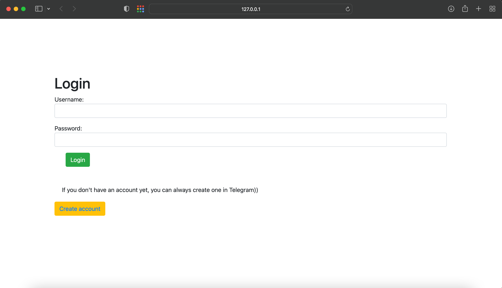
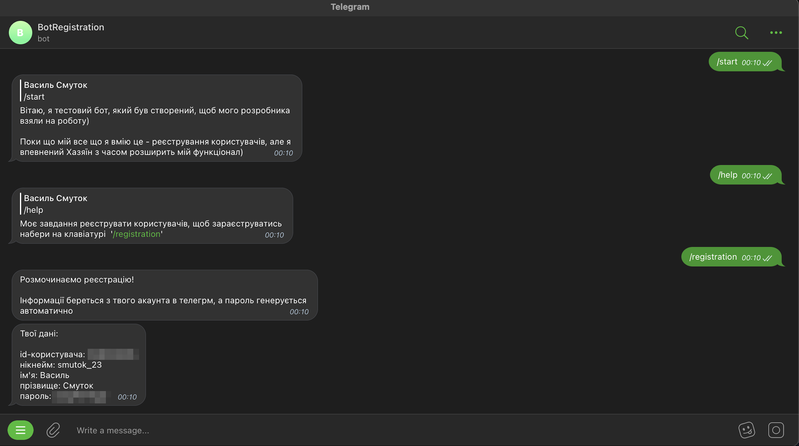

# Registration via Telegram


The project was created using Django and Aiogram, instead of a database it was decided to use Airtable. 
Registration takes place through Telegram Bot. 

I suggest you take a look at what came out of it)

## Check it out!


[Registration via Telegram deployed to Heroku](#)

[Telegram Bot](https://t.me/registration23_bot)


## Installation

Python3 must be already installed

```shell
git clone https://github.com/Vasyl-Smutok/django-tgbot.git
cd django-tgbot
python3 -m venv venv
source venv/bin/activate  # on macOS
venv\Scripts\activate  # on Windows 
pip install -r requirements.txt  
python manage.py start_bot # run your telegram bot
python manage.py runserver # start Django Server
```


## Demo 


